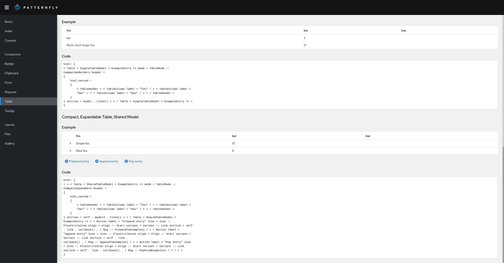

# PatternFly components for Yew

[Yew](https://yew.rs/) components, based on [PatternFly](https://www.patternfly.org):

> PatternFly is an open source design system built to drive consistency and unify teams.

> Yew is a framework for creating reliable and efficient web applications.

---

## Getting starting

Take a look at the demo, which shows various features of the project: https://ctron.github.io/patternfly-yew-quickstart

The code of the demo is also intended to be a quickstart/template project, to get you started with just a few commands: https://github.com/ctron/patternfly-yew-quickstart
